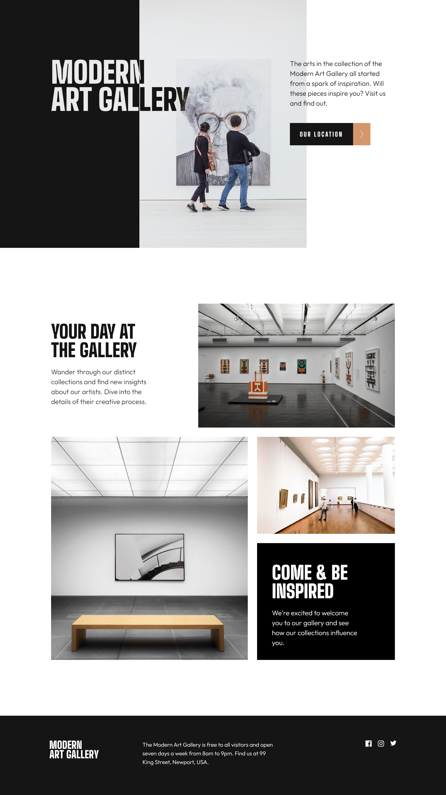

# **Art gallery website**

This is a solution to the [challenge on Frontend Mentor](https://www.frontendmentor.io/challenges/art-gallery-website-yVdrZlxyA). 

Check out the [live URL](https://your-live-site-url.com)

## **The challenge**
Users should be able to:
- View the optimal layout for each page depending on their device's screen size
- See hover states for all interactive elements throughout the site

## **The Solution**

### Built with
- Semantic HTML5 markup
- CSS custom properties
- Flexbox
- Grid
- Mobile-first workflow

### What I learned
This code won't win any awards, but I learned a lot along.
This was my first project to use CSS Grid. This was also my fist project with two pages and first time using mix-blend-mode - which is not actually the 'correct' solution, because the background source of the 'MODERN ART GALLER' should be design black and not the negative of the picture. 
Even though this solution checks all the marks, this solution is not perfect. However I decided that It's better to move on to the next challenge and improve my workflow there, rather than create a bubble and try to make each detail perfect here.

Oh, and I learned cool button animations.

#### *Note for myself if I ever decide to improve this code:*
- use Global CSS for typography,buttons and footer.
- main problems are in header, think with layers.
- use mask mode for 'MODERN ART GALLERY' instead of mix-blend-mode.
- think of general responsiveness not only breakpoints.
- create global 'container' class and apply it to each section to control margins across the screen sizes.
- enjoy the fact that dumber you wrote this code :)

### Resources
- [Reset CSS](https://meyerweb.com/eric/tools/css/reset/)
- [Mask mode in CSS](https://css-tricks.com/almanac/properties/m/mask-mode/)

### Author
- [Iva](https://github.com/ivaberiashvili)